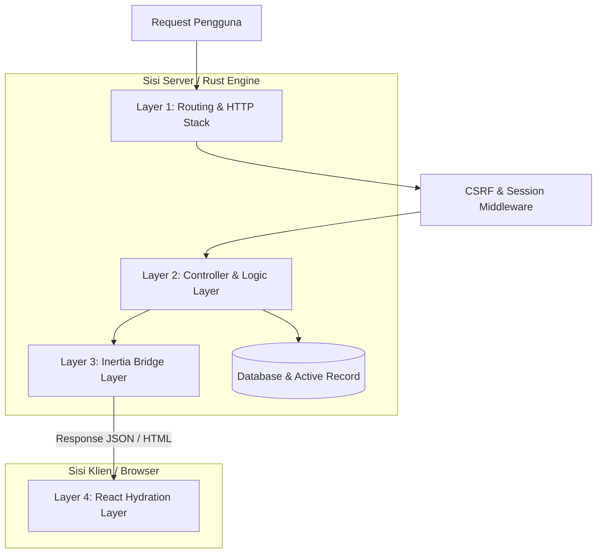

# 🏛️ Panduan Arsitektur Monolith SPA

## 📝 Kata Pengantar
Selamat datang di panduan **Arsitektur Monolith SPA RustBasic**. Dokumentasi ini dirancang khusus untuk memandu pengembang memahami bagaimana server Rust (backend) dapat terintegrasi secara mulus dengan React.js (frontend) dalam satu kesatuan repositori tunggal (Monolith) melalui jembatan protokol Inertia.js.

Melalui panduan ini, Anda akan mempelajari siklus hidup request, proses hidrasi awal, dan teknik pengiriman data global secara instan.

---

## 🛠️ Script Contoh

### A. Mengakses Shared Page Props di React (`src/resources/js/Components/Navbar.tsx`)
Dalam arsitektur Inertia, data global yang dibagikan dari Rust (seperti info login user atau notifikasi) dapat langsung dibaca di komponen React mana pun menggunakan hook `usePage()`.

```tsx
import React from 'react';
import { Link, usePage } from '@inertiajs/react';
import { useRoute } from '../route';

interface PageProps {
  auth?: {
    user?: {
      name: string;
    };
  };
  [key: string]: any;
}

export default function Navbar() {
  // usePage().props otomatis berisi data global (auth, flash, dll) dari backend Rust dengan tipe PageProps
  const { auth } = usePage<PageProps>().props;
  const route = useRoute();

  return (
    <nav className="p-4 bg-slate-900 border-b border-slate-800 text-white flex justify-between items-center">
      <Link href="/" className="text-lg font-bold text-indigo-400">My App</Link>
      
      <div className="flex items-center space-x-4">
        {auth?.user ? (
          <div className="flex items-center space-x-2">
            <span className="text-slate-300">Halo, {auth.user.name}</span>
            <Link href="/logout" method="post" as="button" className="text-sm text-red-400 hover:underline">Keluar</Link>
          </div>
        ) : (
          <Link href="/login" className="text-indigo-400 hover:underline">Masuk Akun</Link>
        )}
      </div>
    </nav>
  );
}
```

### B. Mengirim Flash Message dari Controller Rust
Mekanisme pengiriman data flash session dari controller Rust ke frontend React:
```rust
use rustbasic_core::{Request, IntoResponse};
use rustbasic_core::responses::ResponseHelper;

pub async fn login_user(req: Request) -> impl IntoResponse {
    // 1. Menyimpan flash message sukses ke dalam sesi
    req.session.set("success", "Anda berhasil masuk sistem!");
    
    // 2. Mengalihkan user ke halaman dashboard (status 303)
    ResponseHelper::redirect("/dashboard")
}
```

---

## 🏗️ Struktur Arsitektur 4-Layer RustBasic

Aplikasi RustBasic SPA dibangun dengan struktur modular yang terbagi menjadi 4 lapisan utama:



### 1. Layer 1: Routing & HTTP Stack
Lapisan terdepan server yang menangani koneksi masuk, melakukan inisialisasi sesi, memvalidasi token CSRF, dan merutekan URI ke handler yang sesuai di `src/routes/web.rs` or `src/routes/api.rs`.

### 2. Layer 2: Controller & Logic Layer
Menerima request yang telah divalidasi, memproses logika bisnis utama, berinteraksi dengan database melalui ORM/Query Builder, dan menentukan data apa saja (props) yang akan dikirim ke antarmuka pengguna.

### 3. Layer 3: Inertia Bridge Layer (Core Library)
Menjembatani backend Rust dan React. Berfungsi mendeteksi jenis request:
- Jika request adalah **navigasi SPA internal** (adanya header `X-Inertia`), lapisan ini memformat data props, status flash session, dan error validasi menjadi JSON payload murni.
- Jika request adalah **load pertama**, lapisan ini memformat data tersebut ke dalam kontainer HTML utama `app.rb.html` as state awal.

### 4. Layer 4: React Hydration Layer (`src/resources/js/`)
Menerima payload data dari server dan memetakan komponen halaman secara dinamis di browser klien. Menangani rendering visual, interaksi reaktif, dan navigasi instan tanpa memicu reload halaman penuh.

---

## 📊 Pengiriman Data Global (Shared Props)

Salah satu keunggulan arsitektur RustBasic SPA adalah kemampuan membagikan data penting secara global ke seluruh halaman React secara otomatis. Konfigurasi ini dikelola secara terintegrasi di dalam library **`rustbasic-core`**:

```rust
// Cuplikan logika di dalam rustbasic-core
let errors: std::collections::HashMap<String, String> = req.session.get("errors").unwrap_or_default();
req.session.remove("errors");

let success: Option<String> = req.session.get("success");
req.session.remove("success");

let mut props = props;
if let Value::Object(ref mut map) = props {
    // 1. Menyematkan data errors validasi ke props
    map.insert("errors".to_string(), json!(errors));
    
    // 2. Menyematkan data flash status ke props
    map.insert("flash".to_string(), json!({
        "success": success,
        "error": error,
        // ...
    }));
    
    // 3. Menyematkan data auth user (jika login) ke props
    let user_id = req.session.get::<i32>("user_id").unwrap_or(0);
    let user_data = if user_id > 0 {
        // Ambil data user dari DB...
        Some(user)
    } else {
        None
    };
    map.insert("auth".to_string(), json!({ "user": user_data }));
}
```

Dengan menyematkan data-data tersebut ke level props terluar Inertia, Anda tidak perlu lagi menarik data autentikasi atau flash message secara berulang-ulang di setiap fungsi controller Anda. Semuanya disuplai secara terpusat.

---

## 🔄 Perbandingan Pemakaian (Traditional MVC vs Monolith SPA)

Berikut adalah perbandingan pemakaian arsitektur antarmuka aplikasi:

| Aspek Arsitektur | Traditional MVC (Template Server) | Monolith SPA (React-Inertia) |
| :--- | :--- | :--- |
| **Bahasa Tampilan** | Menulis markup Jinja/HTML di sisi backend Rust. | Menulis komponen modern React (.tsx) di frontend. |
| **Siklus Navigasi** | Browser memuat ulang seluruh halaman saat klik link. | Halaman dimuat instan tanpa reload (AJAX swap). |
| **Metode Pengiriman Data** | Data digabungkan ke template sebelum HTML dikirim. | Data dikirim berupa props JSON mentah secara berkala. |
| **Siklus Hidup State** | State JavaScript di client hilang setiap kali berpindah link. | State React global tetap terjaga sepanjang navigasi. |
| **Keamanan Rute** | Proteksi rute sepenuhnya di sisi server. | Proteksi rute di server & UX dinamis di sisi klien. |

---

## 📊 Tabel Ringkasan Siklus Hidup Request SPA

Berikut adalah urutan proses saat pengguna berinteraksi dengan aplikasi Monolith SPA RustBasic:

| Tahap Siklus | Aksi Pengguna / Browser | Respon Server RustBasic |
| :--- | :--- | :--- |
| **1. Kunjungan Awal** | Mengetik URL di address bar (atau tekan F5). | Merender HTML root kontainer `app.rb.html` beserta data awal di `data-page`. |
| **2. React Hydration** | React memuat data di atribut `'data-page'`. | Selesai bertugas, browser dihidupkan menjadi aplikasi dinamis. |
| **3. Navigasi Tautan** | Pengguna mengklik `<Link href="/about">`. | Memotong rute request, mengirim AJAX dengan header `X-Inertia: true`. |
| **4. JSON Delivery** | Inertia menangkap respon JSON terbaru. | Server hanya mengembalikan JSON props tanpa kerangka HTML. |
| **5. Page Render** | React langsung menukar komponen di layar. | Siap menerima interaksi navigasi berikutnya. |

---

## 🏁 Penutup
Arsitektur Monolith SPA memberikan efisiensi luar biasa dalam proses *development* karena menghilangkan kebutuhan REST API yang kompleks, sambil memberikan pengalaman visual tingkat tinggi bagi pengguna akhir aplikasi Anda.
