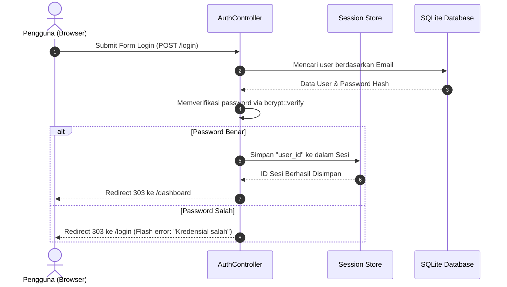

# 🔐 Panduan Autentikasi Breeze

## 📝 Kata Pengantar
Selamat datang di panduan **Breeze Authentication Scaffolding**. Dokumentasi ini dirancang khusus untuk memandu Anda memasang dan mengelola sistem login, registrasi, lupa password, reset kata sandi, dan halaman dashboard premium secara instan. 

Breeze mengotomatisasi penyusunan berkas backend (Rust) dan frontend (React) sehingga Anda dapat memiliki sistem autentikasi yang aman, terlindungi dari ancaman CSRF, dan siap pakai dalam hitungan detik.

---

## 🛠️ Script Contoh

### A. Penambahan Paket Breeze ke Bagian dependencies (`Cargo.toml`)
Breeze diaktifkan melalui compile-time cfg flag kustom di dependensi lokal Anda:
```toml
[dependencies]
rustbasic-core = "0.1"
# Mengimpor modul breeze untuk bootstrapping autentikasi
rustbasic-breeze = { version = "0.0", optional = true }

[features]
# Mengaktifkan feature breeze otomatis
breeze = ["dep:rustbasic-breeze"]
```

### B. Hashing Sandi Pengguna Menggunakan Bcrypt
Setiap password pengguna wajib di-hash menggunakan algoritma Bcrypt dengan cost factor yang disarankan (12) sebelum disimpan ke dalam database.
```rust
use rustbasic_core::bcrypt::{hash, DEFAULT_COST};

// Hashing password dengan salt cost aman (12)
let plain_password = "password_rahasia_saya";
let password_hash = hash(plain_password, DEFAULT_COST).unwrap();

// Verifikasi password (mengembalikan bool)
let is_match = rustbasic_core::bcrypt::verify("password_rahasia_saya", &password_hash).unwrap();
```

### C. Proteksi Rute Melalui Auth Middleware (`src/routes/web.rs`)
Mengamankan rute internal aplikasi agar hanya dapat diakses oleh user yang telah terautentikasi:
```rust
use rustbasic_core::{Router, get, from_fn, AppState};
use crate::app::http::controllers::dashboard_controller;
use crate::app::http::middleware::auth::auth_middleware;

pub fn router() -> Router<AppState> {
    Router::new()
        // Rute dashboard utama terproteksi
        .route("/dashboard", get(dashboard_controller::index))
        // Menerapkan layer middleware auth
        .layer(from_fn(auth_middleware))
}
```

---

## 🚀 Cara Kerja & Alur Autentikasi Breeze

Breeze dirancang dengan konsep **Session-based Authentication** yang dienkripsi kuat di sisi server:



### Penjelasan Detil Rute Otomatis (Auth Routes):
1. **Pendaftaran (Registration)**:
   - `GET /register`: Menampilkan form registrasi.
   - `POST /register`: Melakukan validasi input, memeriksa duplikasi email di database, melakukan hash password, menyimpan user baru, dan mengarahkan ke halaman login.
2. **Masuk Akun (Login)**:
   - `GET /login`: Menampilkan halaman login split-screen premium.
   - `POST /login`: Memvalidasi kredensial email & password, menginisiasi sesi `user_id`, dan mengarahkan ke `/dashboard`.
3. **Lupa Kata Sandi (Password Recovery)**:
   - `GET /forgot-password`: Formulir request link reset sandi.
   - `POST /forgot-password`: Membuat token reset acak (UUID), menyimpannya di database dengan masa kedaluwarsa 1 jam, mengirimkan email pemulihan HTML via SMTP.
   - `GET /reset-password/:token`: Halaman formulir pembuatan password baru.
   - `POST /reset-password`: Melakukan update password baru di database dan menghapus token pemulihan.

---

## 📊 Tabel Ringkasan Berkas Tergenerasi

Ketika fitur Breeze diaktifkan, generator CLI secara otomatis menyusun dan menyematkan berkas-berkas berikut ke dalam proyek Anda:

| Berkas Terbuat | Lokasi Penyimpanan File | Deskripsi Peran Berkas |
| :--- | :--- | :--- |
| **Controller Auth** | `src/app/http/controllers/auth/auth_controller.rs` | Mengolah request masuk login, registrasi, logout, lupa password, & reset sandi. |
| **Middleware Auth** | `src/app/http/middleware/auth.rs` | Penjaga pintu rute yang membelokkan user tak dikenal ke halaman `/login`. |
| **Rute Tamu** | `src/routes/auth.rs` | Rute web terpisah untuk penanganan login, daftar, & pemulihan kata sandi. |
| **Rute Dashboard** | `src/routes/dashboard.rs` | Rute web terpisah terproteksi untuk dashboard utama. |
| **Halaman React** | `src/resources/js/Pages/Auth/` | Kumpulan file UI React (.tsx) halaman login, register, forgot-password, & reset-password. |
| **Template Email** | `src/resources/views/emails/` | Template email HTML SMTP untuk reset link password. |

---

## 🔄 Perbandingan Pemakaian (Autentikasi Manual vs Scaffolding Breeze)

Berikut adalah perbandingan pemakaian antara menulis sistem keamanan autentikasi secara manual dan menggunakan scaffolding otomatis Breeze:

| Parameter Proses | Membangun Sistem Manual | Menggunakan Scaffolding Breeze |
| :--- | :--- | :--- |
| **Waktu Pembangunan** | Membutuhkan waktu berhari-hari untuk merancang tabel, enkripsi, dan UI. | Instan (terbuat otomatis saat fitur ditambahkan). |
| **Struktur File** | Rawan tidak konsisten, rentan bug impor, dan sulit dirawat. | Sangat rapi mengikuti konvensi standard framework RustBasic. |
| **Fitur Lupa Password** | Harus mendesain UUID token, timer expired, & SMTP secara manual. | Sudah siap pakai beserta template email HTML bawaan. |
| **Halaman Visual** | Harus mendesain stylesheet, responsive login, & register form sendiri. | Disediakan halaman login split-screen premium & modern. |
| **Keamanan Sesi** | Harus mengelola enkripsi cookie & session store secara manual. | Terintegrasi dengan sistem Session AES-GCM bawaan RustBasic Core. |

---

## 🗑️ Otomatisasi Uninstall & Clean-Up Sistem

Apabila Anda memutuskan untuk menghapus modul autentikasi Breeze dan ingin mengembalikan proyek ke status bersih tanpa autentikasi, Anda dapat menjalankan perintah uninstall berikut melalui CLI:

```bash
cargo run --package rustbasic-cli -- uninstall rustbasic-breeze
```

### Tindakan Pembersihan yang Dilakukan CLI:
1. **Penghapusan Berkas**: Seluruh file routing (`src/routes/auth.rs`, `src/routes/dashboard.rs`), controllers (`src/app/http/controllers/auth/`), middleware (`src/app/http/middleware/auth.rs`), views React (`src/resources/js/Pages/Auth/`), dan email templates yang digenerate akan dihapus permanen.
2. **Pelepasan Impor**: CLI memindai dan memperbarui berkas deklarasi seperti `src/routes/web.rs`, `src/routes/mod.rs`, dan `src/app/http/middleware/mod.rs` untuk melepas impor rute Breeze secara bersih tanpa meninggalkan *warning unused imports*.
3. **Pembersihan Database**: Menjalankan rollback migrasi tabel `users` dan `sessions` yang terasosiasi dengan Breeze jika didukung, mengembalikan database ke skema asal.

---

## 🏁 Penutup
Dengan memanfaatkan paket autentikasi Breeze, Anda mendapatkan fondasi keamanan sistem akun yang teruji secara industri, terlindung dari eksploitasi celah CSRF, serta siap melayani pengguna dengan tampilan visual yang sangat premium.
