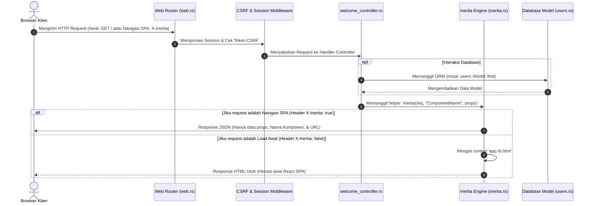

# 🚀 Panduan Lengkap Dasar-Dasar RustBasic SPA

## 📝 Kata Pengantar
Selamat datang di panduan dasar **RustBasic SPA (Single Page Application)**. Proyek ini dibangun di atas arsitektur web modern yang menjembatani performa tinggi dan keamanan tipe data dari **Rust** pada backend dengan kedinamisan **React.js** pada frontend melalui jembatan **Inertia.js**.

Dengan konsep **Inertia SPA**, Anda dapat membangun aplikasi berkinerja Single Page Application (SPA) tanpa perlu membuat API RESTful terpisah atau mengelola sistem routing client-side yang rumit. Semuanya diatur dalam struktur monolith yang sangat produktif.

Dokumentasi ini dirancang untuk memandu Anda memahami konsep inti, alur request-response, dan pilar-pilar penting dalam pengembangan aplikasi dengan RustBasic.

---

## 🔄 Siklus Hidup Request-Response (Inertia SPA)

Berikut adalah diagram alur bagaimana request diproses di dalam RustBasic SPA:



### Penjelasan Langkah Alur Kerja:
1. **Inisiasi Request**: Pengguna memicu request ke server, baik lewat penulisan URL langsung pada browser (load pertama) atau navigasi internal menggunakan komponen `<Link>` dari Inertia (SPA transition).
2. **Routing & Middleware**: Request disaring oleh server RustBasic untuk memvalidasi sesi (session) dan memeriksa token CSRF jika metode request adalah mutasi data (POST, PUT, DELETE).
3. **Controller & Logika Bisnis**: Route mencocokkan URL dan mengarahkannya ke fungsi *controller*. Di sini, Anda dapat memproses query, berinteraksi dengan database melalui ORM/Active Record, dan mengumpulkan data (props).
4. **Respon Inertia**: Controller memanggil fungsi pembantu `inertia`. Fungsi ini mendeteksi apakah request dikirim oleh engine client Inertia (adanya header `X-Inertia` bernilai `true`):
   - **Ya (Navigasi SPA)**: Server hanya mengembalikan JSON mentah yang berisi payload data props baru. Halaman React tidak dimuat ulang (no full reload), hanya state komponen halaman yang diperbarui secara instan.
   - **Tidak (Load Pertama)**: Server merender template HTML `app.rb.html` sebagai cangkang, menyematkan payload JSON di dalam atribut `data-page`, lalu mengirimkannya ke browser untuk inisialisasi awal.

---

## 📌 Pilar 1: Perutean (Routing)

Perutean di RustBasic bertugas memetakan pola URI ke fungsi penangan (*handler controller*) tertentu. Mesin routing RustBasic mendukung berbagai fungsi penolong (*router functions*) dan pengelompokan rute menggunakan awalan (*route prefix*).

### A. Lokasi Berkas Routing
- **`src/routes/web.rs`**: Tempat mendefinisikan rute web (biasanya mengembalikan respon HTML via Inertia).
- **`src/routes/api.rs`**: Tempat mendefinisikan rute API (biasanya mengembalikan JSON murni untuk integrasi eksternal).
- **`src/routes/mod.rs`**: Berkas penggabung yang menyatukan seluruh rute aplikasi menggunakan metode `.merge()`:
  ```rust
  pub fn build_router() -> Router<AppState> {
      web::router().merge(api::router())
  }
  ```

### B. Daftar Fungsi Router (Router Functions)

Struktur `Router<S>` di RustBasic menyediakan metode-metode berikut untuk mendefinisikan dan mengonfigurasi rute:

| Metode Router | Deskripsi Fungsi | Contoh Penggunaan |
| :--- | :--- | :--- |
| **`Router::new()`** | Membuat instansiasi router baru kosong. | `Router::new()` |
| **`.route(path, method)`** | Mendaftarkan rute dengan method router tertentu (`get`, `post`, `put`, `delete`, dll). | `.route("/", get(welcome_controller::index))` |
| **`.get_json(path, data)`** | Shortcut untuk rute GET yang langsung mengembalikan data JSON serializable. | `.get_json("/status", json!({"status": "ok"}))` |
| **`.get_redirect(path, to)`** | Shortcut rute GET untuk langsung mengarahkan (redirect) ke URL lain. | `.get_redirect("/old-path", "/new-path")` |
| **`.get_view(path, tpl, ctx)`**| Shortcut rute GET untuk merender berkas HTML template (Minijinja) langsung. | `.get_view("/welcome", "welcome.html", json!({}))` |
| **`.merge(other_router)`** | Menggabungkan seluruh rute dan middleware dari router lain. | `web_router.merge(api_router)` |
| **`.prefix(prefix)`** | Menambahkan awalan path ke seluruh rute yang saat ini telah terdaftar di router tersebut. | `router.prefix("/admin")` |
| **`.nest(prefix, other)`** | Memasang sekelompok rute dari router lain di bawah awalan path tertentu. | `router.nest("/api/v1", api_router)` |
| **`.layer(middleware_fn)`** | Menerapkan fungsi middleware ke seluruh rute di dalam router tersebut. | `.layer(auth_middleware)` |

---

### C. Penggunaan Route Prefix & Nesting

#### 1. Menambahkan Prefix ke Router Saat Ini (`.prefix`)
Metode `.prefix` akan mengubah semua rute yang telah didefinisikan sebelumnya pada router tersebut dengan menambahkan awalan tertentu. Contoh:

```rust
pub fn admin_router() -> Router<AppState> {
    Router::new()
        .route("/dashboard", get(admin_controller::dashboard)) // URL asal: /dashboard
        .route("/settings", get(admin_controller::settings))   // URL asal: /settings
        .prefix("/admin") // Menambahkan awalan sehingga menjadi: /admin/dashboard & /admin/settings
}
```

#### 2. Menumpuk Router dengan Prefix (`.nest`)
Metode `.nest` digunakan untuk mengelompokkan router eksternal di bawah prefix tertentu secara modular. Ini sangat berguna untuk versi API atau pemisahan modul besar:

```rust
pub fn router() -> Router<AppState> {
    let api_v1 = Router::new()
        .route("/users", get(api_controller::users_index))
        .route("/posts", get(api_controller::posts_index));

    Router::new()
        // Menggabungkan api_v1 di bawah prefix "/api/v1"
        // Menghasilkan rute: /api/v1/users & /api/v1/posts
        .nest("/api/v1", api_v1)
}
```

---

### D. Rute Inline Cepat (Closure Routing)
Untuk prototyping cepat tanpa membuat file controller baru, Anda dapat mendefinisikan rute inline:
```rust
Router::new()
    .route("/hello", get(|| async { "Halo dari RustBasic SPA!" }))
```
> [!TIP]
> Informasi lebih lengkap mengenai closure routing dapat Anda baca di dokumen **[Perutean Inline Cepat](inline_routing.md)**.


---

## 📌 Pilar 2: Pengendali (Controllers)

Controller berisi logika pemrosesan request dan bertindak sebagai jembatan antara Model (Database) dan View (React).

### A. Anatomi Fungsi Controller
Setiap handler controller di RustBasic adalah fungsi asinkron dengan parameter `Request` dan mengembalikan tipe data yang mengimplementasikan trait `IntoResponse`:
```rust
use rustbasic_core::{Request, IntoResponse};
use rustbasic_core::serde_json::json;
use crate::app::inertia;

pub async fn my_handler(req: Request) -> impl IntoResponse {
    // Logika pengolahan data Anda...
    inertia(&req, "MyComponent", json!({ "key": "value" }))
}
```

### B. Interaksi dengan Request & Session
Melalui parameter `Request`, Anda dapat mengakses data input, header, cookies, dan session:

#### 1. Membaca Query Parameter & Input JSON
Anda dapat menggunakan parser bawaan untuk mengekstrak data JSON atau query string dari request.

#### 2. Manajemen Session
Session dapat dibaca dan dimanipulasi dengan mudah menggunakan type safety:
```rust
// Menyimpan data ke dalam Session
req.session.set("user_role", "administrator".to_string());

// Membaca data dari Session (mengembalikan Option<T>)
let role: Option<String> = req.session.get("user_role");

// Menghapus data dari Session
req.session.remove("user_role");
```

### C. Mengakses State Aplikasi (AppState)
Untuk mengakses konfigurasi global atau koneksi database pool yang dibagikan secara global, gunakan ekstraktor `State`:
```rust
use rustbasic_core::{State, AppState};

pub async fn show_config(State(state): State<AppState>, req: Request) -> impl IntoResponse {
    let app_name = &state.config.app_name;
    // ...
}
```

---

## 📌 Pilar 3: Tampilan (Views - React & Inertia)

Views di RustBasic menggunakan React.js (.jsx / .tsx) yang diletakkan di direktori `src/resources/js/Pages/`.

### A. Template Awal (Root Template HTML)
Semua halaman SPA akan di-mount ke dalam file kontainer HTML utama `src/resources/views/app.rb.html`:
```html
<div id="app" data-page='{{ page | tojson | safe }}'></div>
```
Tag `{{ vite_assets | safe }}` digunakan untuk menyematkan aset hasil kompilasi Vite (JS/CSS) secara dinamis baik di mode development (Hot Module Replacement) maupun mode production.

### B. Penulisan Halaman React (Welcome.jsx)
Komponen halaman React menerima data *props* yang dikirim oleh backend Rust secara langsung:
```jsx
import React from 'react';
import { Link } from '@inertiajs/react';

export default function Welcome({ title, auth_installed, is_logged_in }) {
  return (
    <div className="p-8 bg-slate-950 text-white min-h-screen">
      <h1 className="text-3xl font-extrabold text-indigo-400">{title}</h1>
      
      {auth_installed && (
        <div className="mt-4">
          {is_logged_in ? (
            <Link href="/dashboard" className="px-4 py-2 bg-green-600 rounded">Masuk Dashboard</Link>
          ) : (
            <Link href="/login" className="px-4 py-2 bg-indigo-600 rounded">Log In</Link>
          )}
        </div>
      )}
    </div>
  );
}
```

> [!IMPORTANT]
> **Navigasi Tanpa Reload**
> Selalu gunakan komponen `<Link>` dari `@inertiajs/react` untuk setiap tautan navigasi internal agar transisi halaman tetap berjalan lancar secara SPA tanpa adanya reload browser. Penggunaan tag `<a>` biasa akan memicu reload penuh dan membuang state React yang tersimpan di browser.

---

## 📌 Pilar 4: Model & Database (Overview)

RustBasic mempermudah interaksi database menggunakan ORM Active Record yang didefinisikan lewat macro `model!`.

```rust
// src/app/models/users.rs
use rustbasic_core::model;

model! {
    table: "users",
    fillable: [name, email, password],
    Model {
        pub id: i32,
        pub name: String,
        pub email: String,
        pub password: String,
    }
}
```

Anda dapat menggunakan model tersebut langsung di controller untuk mengambil atau memanipulasi data:
```rust
// Mengambil semua user
let all_users = users::Model::all(&db).await.unwrap_or_default();

// Mencari satu user berdasarkan ID
let user = users::Model::find(&db, 1).await.unwrap();
```
> [!TIP]
> Detail selengkapnya tentang CRUD, kueri kompleks (Fluent Query Builder), relasi, scopes, soft deletes, dan seeder dapat dibaca di **[Panduan Database & Migrasi](database.md)**.

---

## 🎓 Tutorial Praktis: Membuat Fitur Formulir Kontak Baru

Untuk mengasah pemahaman Anda, mari ikuti tutorial langkah-demi-langkah dalam membangun sebuah fitur halaman formulir kontak sederhana beserta pemrosesan data dan pesan notifikasi (flash message).

### Langkah 1: Daftarkan Rute Baru
Edit berkas `src/routes/web.rs` untuk menambahkan rute GET (untuk menampilkan halaman form) dan POST (untuk memproses submit data formulir).

```rust
// src/routes/web.rs
use rustbasic_core::{Router, get, post, AppState};
use crate::app::http::controllers::welcome_controller;

pub fn router() -> Router<AppState> {
    Router::new()
        .route("/", get(welcome_controller::index))
        .route("/about", get(welcome_controller::about))
        
        // Rute untuk Formulir Kontak
        .route("/contact", get(welcome_controller::contact_form))
        .route("/contact/submit", post(welcome_controller::contact_submit))
}
```

### Langkah 2: Tambahkan Fungsi di Controller
Tambahkan logika hander di dalam file `src/app/http/controllers/welcome_controller.rs` untuk menyajikan view form serta mengolah input post dengan pengembalian pesan status flash session.

```rust
// Tambahkan di src/app/http/controllers/welcome_controller.rs

/// 1. Menampilkan halaman formulir
pub async fn contact_form(req: Request) -> impl IntoResponse {
    inertia(&req, "Contact", json!({
        "title": "Hubungi Kami"
    }))
}

/// 2. Memproses data formulir
pub async fn contact_submit(req: Request) -> impl IntoResponse {
    // Skenario: Ambil parameter input (contoh sederhana)
    // Di aplikasi nyata, Anda bisa mem-parsing struct JSON atau body request
    
    // Set pesan sukses ke session
    req.session.set("success", "Pesan Anda berhasil dikirim! Terima kasih.".to_string());
    
    // Lakukan redirect ke halaman /contact menggunakan response redirect HTTP 303
    // Inertia membutuhkan status 303 untuk redirect setelah request POST/PUT/DELETE
    rustbasic_core::responses::ResponseHelper::redirect("/contact")
}
```

### Langkah 3: Buat Halaman React (Contact.jsx)
Buat berkas baru bernama `src/resources/js/Pages/Contact.jsx`. Di sini kita memanfaatkan hook `useForm` dari `@inertiajs/react` untuk mengelola input state dan memproses pengiriman data formulir.

```jsx
import React from 'react';
import { useForm, usePage } from '@inertiajs/react';

export default function Contact({ title }) {
  // Mengambil data flash session yang otomatis disuplai oleh RustBasic Inertia middleware
  const { flash } = usePage().props;

  const { data, setData, post, processing, reset } = useForm({
    name: '',
    email: '',
    message: '',
  });

  const handleSubmit = (e) => {
    e.preventDefault();
    post('/contact/submit', {
      onSuccess: () => {
        reset(); // Kosongkan formulir setelah berhasil dikirim
      }
    });
  };

  return (
    <div className="max-w-md mx-auto my-12 p-8 bg-slate-900/60 border border-slate-800 rounded-2xl backdrop-blur-md text-white">
      <h2 className="text-2xl font-bold mb-6 text-indigo-400">{title}</h2>
      
      {/* Alert Notifikasi Sukses */}
      {flash?.success && (
        <div className="mb-4 p-4 bg-emerald-950/50 border border-emerald-800 text-emerald-400 rounded-lg text-sm">
          {flash.success}
        </div>
      )}

      <form onSubmit={handleSubmit} className="space-y-4">
        <div>
          <label className="block text-sm font-medium text-slate-300 mb-1">Nama</label>
          <input
            type="text"
            value={data.name}
            onChange={e => setData('name', e.target.value)}
            required
            className="w-full px-4 py-2 bg-slate-950 border border-slate-800 rounded-lg focus:outline-none focus:border-indigo-500 text-white"
          />
        </div>
        
        <div>
          <label className="block text-sm font-medium text-slate-300 mb-1">Email</label>
          <input
            type="email"
            value={data.email}
            onChange={e => setData('email', e.target.value)}
            required
            className="w-full px-4 py-2 bg-slate-950 border border-slate-800 rounded-lg focus:outline-none focus:border-indigo-500 text-white"
          />
        </div>
        
        <div>
          <label className="block text-sm font-medium text-slate-300 mb-1">Pesan</label>
          <textarea
            value={data.message}
            onChange={e => setData('message', e.target.value)}
            required
            rows="4"
            className="w-full px-4 py-2 bg-slate-950 border border-slate-800 rounded-lg focus:outline-none focus:border-indigo-500 text-white"
          ></textarea>
        </div>
        
        <button
          type="submit"
          disabled={processing}
          className="w-full py-2 bg-indigo-600 hover:bg-indigo-700 disabled:opacity-50 text-white font-semibold rounded-lg transition"
        >
          {processing ? 'Sedang Mengirim...' : 'Kirim'}
        </button>
      </form>
    </div>
  );
}
```

---

## 📊 Tabel Ringkasan Komponen Dasar

Berikut adalah ringkasan berkas-berkas utama yang terlibat di dalam struktur aplikasi dasar:

| Nama Komponen | Jalur Berkas Utama | Deskripsi & Kegunaan |
| :--- | :--- | :--- |
| **Konfigurasi Awal**| [`.env`](file:///.env) | Tempat konfigurasi variabel environtment (koneksi database, port server, debug mode). |
| **Engine Utama** | [`src/main.rs`](file:///src/main.rs) | Berkas utama inisialisasi logger, pemuatan state db, session store, dan booting HTTP server. |
| **Router Utama** | [`src/routes/web.rs`](file:///src/routes/web.rs) | Berkas untuk memetakan alamat URL halaman situs ke fungsi controller yang sesuai. |
| **Controller** | [`src/app/http/controllers/`](file:///src/app/http/controllers/) | Direktori penampung berkas pengolah request bisnis, penyuplai props data, dan response. |
| **Inertia Bridge** | [`src/app/inertia.rs`](file:///src/app/inertia.rs) | Helper internal backend untuk menangani negosiasi format data JSON Inertia atau HTML layout. |
| **React Pages** | [`src/resources/js/Pages/`](file:///src/resources/js/Pages/) | Direktori berkas komponen React (.jsx/.tsx) sebagai penampil antarmuka halaman di browser. |
| **Persistent Layout**| [`src/resources/js/Layouts/`](file:///src/resources/js/Layouts/) | Direktori layout kerangka halaman (Navbar, Sidebar, Footer) yang persistensinya terjaga saat navigasi. |
| **Root Template** | [`src/resources/views/app.rb.html`](file:///src/resources/views/app.rb.html) | Berkas template HTML Minijinja utama tempat di-mount-nya aplikasi client React. |

---

## 🔄 Perbandingan Pemakaian (MPA vs SPA)

Berikut adalah tabel perbandingan pemakaian antara arsitektur Multi-Page Application (MPA) tradisional berbasis server template dan arsitektur Single Page Application (SPA) berbasis React-Inertia di RustBasic:

| Karakteristik | Multi-Page Application (MPA) | Single-Page Application (SPA) |
| :--- | :--- | :--- |
| **Siklus Navigasi** | Memuat ulang seluruh halaman (full reload), layar berkedip putih saat pindah link. | Navigasi instan tanpa reload browser. Hanya menukar komponen & data props halaman. |
| **Performa Kecepatan** | Lambat karena server harus memproses ulang seluruh layout HTML dan mengunduh ulang aset. | Sangat cepat karena server hanya mengirim payload JSON terkompresi. |
| **Integrasi State** | State JavaScript di client hilang setiap kali berpindah halaman. | State global (React context/state) tetap terjaga sepanjang sesi navigasi. |
| **Pengalaman Pengguna (UX)**| Kaku seperti website dinamis tahun 2010-an. | Mulus, responsif, dan interaktif seperti aplikasi native desktop atau mobile. |
| **Kemudahan Developer** | Layout terpisah dan manipulasi DOM manual menggunakan jQuery/Vanilla JS. | Komponen modular terpusat menggunakan ekosistem React modern dan Tailwind CSS. |

---

## 🏁 Penutup & Langkah Selanjutnya

Dengan memahami alur kerja dasar perutean (`Router`), pengolahan data (`Controller`), dan visualisasi halaman (`View` React), Anda kini siap untuk melangkah ke tingkat berikutnya.

Rekomendasi langkah pembelajaran selanjutnya:
1. **[Views & JSX Komponen](views.md)**: Pelajari teknik styling premium Tailwind CSS, layout persistent, dan form helper.
2. **[Manajemen Database & Migrasi](database.md)**: Pelajari ORM, relasi antar tabel, soft-deletes, dan transaksi database.
3. **[Routing & HTTP Stack](http.md)**: Pelajari cara kerja middleware kustom, proteksi CSRF, dan parsing request body.
