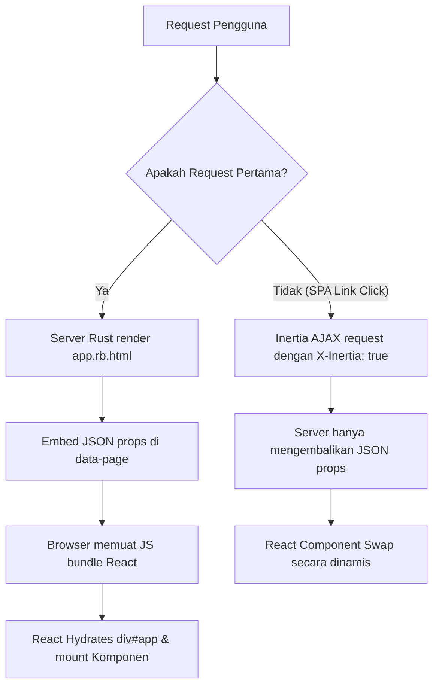

# 🎨 Panduan Views, JSX Komponen, & Desain UI

## 📝 Kata Pengantar
Selamat datang di panduan pembangunan **Views & JSX Komponen**. Dokumentasi ini dirancang untuk memandu Anda merancang antarmuka pengguna (UI) modern yang reaktif, interaktif, dan ultra-premium menggunakan **React.js**, **Tailwind CSS**, dan jembatan **Inertia.js** pada framework **RustBasic**. 

Melalui panduan ini, Anda akan memahami daur rendering SPA monolith, penggunaan persistent layouts untuk efisiensi render DOM, pemanfaatan Inertia form helper untuk validasi reaktif, hingga teknik penyajian aset dengan performa tinggi (HMR & production bundling).

---

## 🛠️ Script Contoh

### A. Komponen Layout Persisten (`src/resources/js/Layouts/AppLayout.tsx`)
Layout persisten digunakan sebagai kerangka luar (header, sidebar, footer) agar tidak merender ulang seluruh DOM visual saat berpindah halaman.

```jsx
import React from 'react';
import { Link, usePage } from '@inertiajs/react';

export default function AppLayout({ children }) {
  // Mengambil user login & flash message secara global dari backend Rust
  const { auth, flash } = usePage().props;

  return (
    <div className="min-h-screen bg-slate-950 text-slate-100 flex flex-col font-sans">
      {/* Header Bar */}
      <header className="bg-slate-900/80 border-b border-slate-800 backdrop-blur-md sticky top-0 z-50 px-6 py-4 flex justify-between items-center">
        <Link href="/" className="text-xl font-extrabold text-indigo-400 tracking-wide">
          RustBasic <span className="text-white text-sm font-normal">SPA</span>
        </Link>
        <nav className="flex items-center space-x-6">
          <Link href="/" className="hover:text-indigo-400 transition">Beranda</Link>
          <Link href="/about" className="hover:text-indigo-400 transition">Tentang</Link>
          <Link href="/contact" className="hover:text-indigo-400 transition">Kontak</Link>
          {auth?.user ? (
            <div className="flex items-center space-x-3 bg-slate-800 px-3 py-1.5 rounded-lg border border-slate-700">
              <span className="text-sm font-medium">{auth.user.name}</span>
            </div>
          ) : (
            <Link href="/login" className="px-4 py-2 bg-indigo-600 hover:bg-indigo-700 rounded-lg text-sm font-semibold transition">Masuk</Link>
          )}
        </nav>
      </header>

      {/* Main Content Area */}
      <main className="flex-1 max-w-7xl w-full mx-auto p-6">
        {flash?.success && (
          <div className="mb-6 p-4 bg-emerald-950/40 border border-emerald-800/80 text-emerald-400 rounded-xl text-sm flex items-center">
            <i className="fa-solid fa-circle-check mr-2"></i> {flash.success}
          </div>
        )}
        {children}
      </main>

      {/* Footer */}
      <footer className="bg-slate-900/50 border-t border-slate-900 py-6 text-center text-sm text-slate-500">
        &copy; {new Date().getFullYear()} RustBasic SPA Framework. All rights reserved.
      </footer>
    </div>
  );
}
```

### B. Formulir Reaktif dengan Validasi Error (`src/resources/js/Pages/Contact.jsx`)
Menunjukkan penggunaan hook `useForm` dari `@inertiajs/react` untuk pengiriman data dan penanganan validasi asinkron.

```jsx
import React from 'react';
import { useForm, usePage } from '@inertiajs/react';

export default function Contact() {
  const { title } = usePage().props;
  const { data, setData, post, processing, errors, reset } = useForm({
    name: '',
    email: '',
    message: '',
  });

  const handleSubmit = (e) => {
    e.preventDefault();
    post('/contact/submit', {
      onSuccess: () => reset(),
    });
  };

  return (
    <div className="max-w-md mx-auto bg-slate-900/60 border border-slate-800 p-8 rounded-2xl backdrop-blur-md">
      <h1 className="text-2xl font-bold text-indigo-400 mb-6">{title}</h1>
      <form onSubmit={handleSubmit} className="space-y-4">
        <div>
          <label className="block text-sm text-slate-400 mb-1">Nama Lengkap</label>
          <input
            type="text"
            value={data.name}
            onChange={e => setData('name', e.target.value)}
            className="w-full bg-slate-950 border border-slate-800 focus:border-indigo-500 rounded-lg px-4 py-2 text-white outline-none"
          />
          {errors.name && <p className="text-red-500 text-xs mt-1">{errors.name}</p>}
        </div>

        <div>
          <label className="block text-sm text-slate-400 mb-1">Alamat Email</label>
          <input
            type="email"
            value={data.email}
            onChange={e => setData('email', e.target.value)}
            className="w-full bg-slate-950 border border-slate-800 focus:border-indigo-500 rounded-lg px-4 py-2 text-white outline-none"
          />
          {errors.email && <p className="text-red-500 text-xs mt-1">{errors.email}</p>}
        </div>

        <div>
          <label className="block text-sm text-slate-400 mb-1">Pesan Anda</label>
          <textarea
            value={data.message}
            onChange={e => setData('message', e.target.value)}
            rows="4"
            className="w-full bg-slate-950 border border-slate-800 focus:border-indigo-500 rounded-lg px-4 py-2 text-white outline-none resize-none"
          />
          {errors.message && <p className="text-red-500 text-xs mt-1">{errors.message}</p>}
        </div>

        <button
          type="submit"
          disabled={processing}
          className="w-full bg-indigo-600 hover:bg-indigo-700 disabled:opacity-50 text-white font-bold py-2 rounded-lg transition"
        >
          {processing ? 'Sedang Mengirim...' : 'Kirim Pesan'}
        </button>
      </form>
    </div>
  );
}
```

---

## 🔄 Aliran Rendering View & Hidrasi (Hydration)

Bagaimana server Rust dan React saling berkomunikasi dalam hal penyajian UI?



Ketika pertama kali dimuat, server memproses berkas HTML master (`app.rb.html`) dan menginjeksikan data props awal sebagai format string JSON yang aman ke dalam elemen `<div id="app" data-page="JSON">`. React kemudian membaca data tersebut untuk melakukan proses **hidrasi** visual. Pada navigasi internal berikutnya, browser klien mengirimkan request asinkron (AJAX) dan server hanya mengembalikan payload JSON berisi props baru yang akan ditukar ke halaman target tanpa memicu render ulang CSS/JS global.

---

## 🛠️ Pustaka Utama @inertiajs/react API

Berikut adalah beberapa API utama yang wajib Anda pahami untuk mengelola navigasi dan state halaman:

### 1. Komponen `<Link>`
Komponen pengganti tag `<a>` biasa untuk memicu navigasi SPA tanpa reload.
- **Atribut Utama**:
  - `href`: URI tujuan rute.
  - `method`: Metode request (default `get`, bisa diisi `post`, `put`, `patch`, `delete`).
  - `data`: Objek data tambahan untuk dikirim.
  - `preserveScroll`: Menjaga posisi scroll halaman tetap di tempat setelah navigasi selesai (`true`/`false`).
  - `preserveState`: Menjaga state internal halaman agar tidak di-reset (`true`/`false`).

### 2. Hook `usePage()`
Digunakan untuk mengakses properti yang dikirimkan oleh backend Rust secara global maupun lokal:
```javascript
const { props, url, component, version } = usePage();
// props.auth: Data autentikasi user
// props.flash: Pesan flash status
// props.errors: Object penampung pesan error validasi
```

### 3. Hook `useForm()`
Helper tangguh untuk menangani status form secara ringkas dan bebas bug:
```javascript
const { data, setData, post, put, patch, delete: destroy, processing, errors, reset } = useForm({ ... });
```
- `data`: Berisi properti nilai input formulir saat ini.
- `setData(key, value)` atau `setData(object)`: Mengubah isi properti input.
- `post(url, options)`: Mengirim request POST.
- `processing`: Boolean bernilai `true` selama proses submit asinkron berlangsung (sangat cocok untuk men-disable tombol submit).
- `errors`: Object berisi pesan error validasi input per field.

---

## 🔄 Perbandingan Pemakaian (Anchor Link vs Inertia Link)

Berikut adalah perbandingan pemakaian navigasi di dalam arsitektur React SPA:

| Kriteria | Tag Anchor Biasa (`<a>`) | Inertia Link (`<Link>`) |
| :--- | :--- | :--- |
| **Sintaksis** | `<a href="/about">About</a>` | `<Link href="/about">About</Link>` |
| **Siklus Request** | Memicu full round-trip reload ke server. | Mengirimkan request AJAX latar belakang. |
| **Kecepatan** | Lambat (mengunduh ulang seluruh file CSS/JS). | Sangat cepat (hanya menukar data JSON di halaman). |
| **State Preservation** | Semua state React terhapus/direset. | State React global tetap terjaga. |

---

## 📊 Tabel Ringkasan Estetika Desain & Lokasi Folder

Berikut adalah direktori penting dan utilitas styling untuk merancang halaman premium:

| Direktori / Utilitas | Jalur Folder / Kode Tailwind | Deskripsi & Kegunaan |
| :--- | :--- | :--- |
| **Halaman Utama** | `src/resources/js/Pages/` | Folder berisi halaman visual utama (.jsx/.tsx) yang dipetakan oleh rute. |
| **Tata Letak** | `src/resources/js/Layouts/` | Folder berisi persistent layout (header, sidebar, footer) aplikasi. |
| **Komponen Reusable**| `src/resources/js/Components/` | Folder berisi modular UI kecil (Button, Modal, Card) yang digunakan berulang kali. |
| **Glassmorphism** | `bg-slate-900/60 backdrop-blur-md border border-slate-800` | Efek visual kaca transparan blur modern yang elegan dan premium. |
| **Mesh Gradient** | `bg-gradient-to-tr from-slate-950 via-slate-900 to-indigo-950/20` | Kombinasi gradien warna gelap premium untuk latar belakang. |

---

## 📦 Penyajian Aset & Dev Server vs Build Manifest

Dalam proses pengembangan dan produksi, RustBasic mengelola penyajian aset visual (JS/CSS/Image) dengan cerdas:

1. **Mode Pengembangan (App Debug: True)**:
   - Server RustBasic terhubung ke **Vite Dev Server** yang berjalan pada port kustom (default: `5173`).
   - Mendukung **HMR (Hot Module Replacement)** secara instan. Setiap kali Anda menyimpan file JSX, browser akan meng-update visual tanpa refresh halaman.
2. **Mode Produksi (App Debug: False)**:
   - Vite mengompilasi seluruh aset menjadi file static teroptimasi ke dalam folder `dist/` (termasuk kompresi, minifikasi, dan cache-busting hashing).
   - Menghasilkan berkas `manifest.json` yang berisi peta nama file asli ke nama file hasil kompilasi hash (contoh: `main.tsx` -> `assets/main-C9aD2e4f.js`).
   - Server Rust membaca manifest tersebut untuk memuat file yang tepat secara dinamis. Biner final dapat mengemas seluruh berkas static tersebut langsung ke dalam memory executable (*embedded public assets*) untuk deployment satu file mandiri.

---

## 🏁 Penutup
Dengan menerapkan teknik navigasi bebas reload, pemanfaatan hook `useForm` secara optimal, persistent layouts, dan desain modern Tailwind CSS, Anda dapat menyajikan antarmuka pengguna yang sangat cepat, indah, dan nyaman untuk digunakan.
